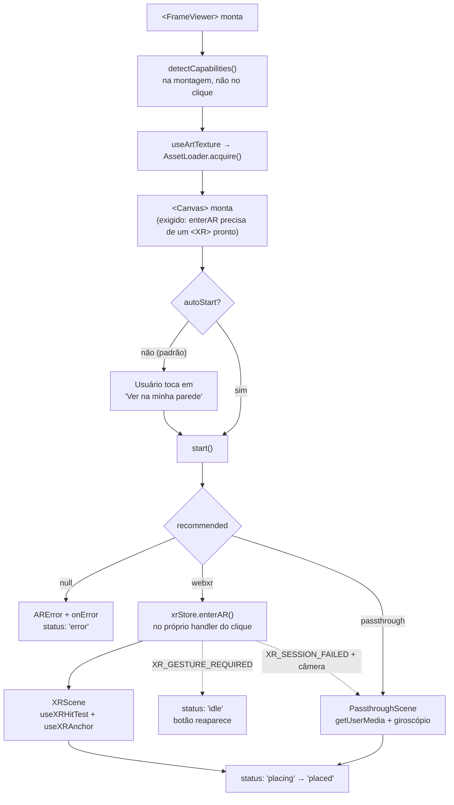
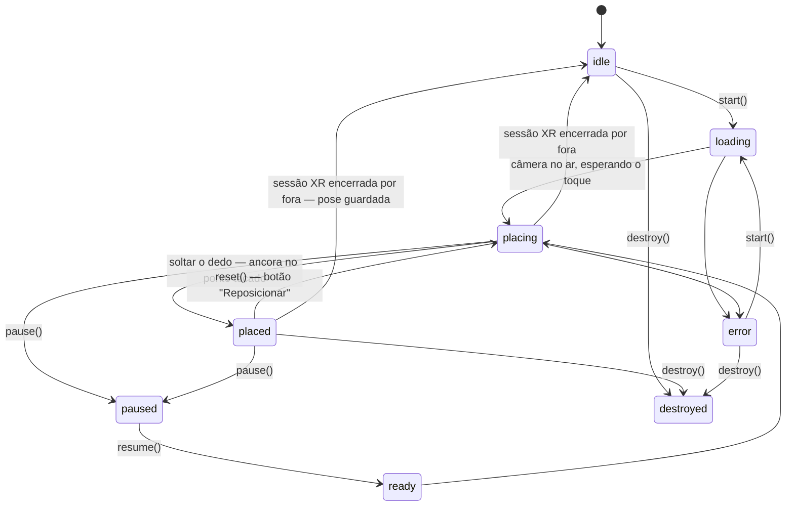

<div align="center">

# 3DWebAR — `webar-frame-viewer`

**Veja o quadro na sua parede, no tamanho real, direto no navegador do celular — sem instalar aplicativo.**

[](LICENSE)
[](#pipeline-de-build)
[](#or%C3%A7amento-de-tamanho)
[](#)

</div>

---

## Sumário

- [O que é](#o-que-é)
- [Demonstração rápida](#demonstração-rápida)
- [Compatibilidade](#compatibilidade)
- [Como funciona](#como-funciona)
- [Instalação](#instalação)
- [Guia de uso](#guia-de-uso)
  - [Vanilla / `<script>` (UMD)](#1-vanilla--script-umd)
  - [ESM / bundler (React)](#2-esm--bundler-react)
  - [React e Next.js](#3-react-e-nextjs)
  - [Esconder o botão quando não há suporte](#4-esconder-o-botão-quando-não-há-suporte)
  - [Ciclo de vida (UMD)](#5-ciclo-de-vida-umd)
- [Referência da API](#referência-da-api)
- [Personalização visual](#personalização-visual)
- [Textos e idiomas](#textos-e-idiomas)
- [Checklist de integração em produção](#checklist-de-integração-em-produção)
- [Privacidade](#privacidade)
- [Desenvolvimento](#desenvolvimento)
- [Testar no celular](#testar-no-celular)
- [Solução de problemas](#solução-de-problemas)
- [Limitações conhecidas](#limitações-conhecidas)
- [Status do projeto](#status-do-projeto)
- [Licença](#licença)

---

## O que é

`webar-frame-viewer` é um **micro front-end** que responde a uma única pergunta de
comércio eletrônico:

> *"Um quadro de 50 × 70 cm fica bom nesta parede aqui?"*

Ele abre a câmera do celular, detecta a parede e desenha o quadro **na escala física
real** — com moldura, passe-partout e sombra em 3D — ancorado no ponto que o comprador
escolher. Tudo dentro do navegador: sem app, sem QR code, sem marcador impresso.

**O que a biblioteca faz por você:**

| | |
|---|---|
| 🧭 **Detecta a parede** | Hit-test de planos do ARCore, filtrando chão e teto por ângulo |
| 📐 **Escala física real** | Você informa centímetros; a lib converte para metros e respeita o FOV da câmera |
| 🖼️ **Monta a moldura em 3D** | Moldura extrudada, passe-partout, painel traseiro e sombra suave gerados em runtime |
| 📱 **Dois engines automáticos** | WebXR onde existe; passthrough por `getUserMedia` no resto (todo iPhone) |
| 🎛️ **Interface pronta** | Overlay completo, acessível, com estados, dicas contextuais e textos em pt-BR/en |
| 📷 **Foto para compartilhar** | Compõe vídeo + WebGL num JPEG e chama a *share sheet* nativa |
| 🛡️ **Erros tratados** | 15 códigos de erro com mensagem pronta para o usuário final |
| 🪶 **Leve e SSR-safe** | Componente React sob `next/dynamic`; bundle CDN de 15,8 KB gzip com `three` sob demanda |

---

## Demonstração rápida

<table>
<tr><th align="left">Vanilla (CDN)</th><th align="left">React / Next.js</th></tr>
<tr valign="top">
<td>

```html
<script src="https://unpkg.com/webar-frame-viewer/dist/frame-viewer.umd.min.js"></script>
<script>
  const viewer = FrameViewer.create({
    container: document.getElementById('root'),
    product: {
      id: 'p1',
      imageUrl: '/quadro.jpg',
      widthCm: 50,
      heightCm: 70,
    },
  });
  viewer.start();
</script>
```

</td>
<td>

```tsx
'use client';
import { FrameViewer } from 'webar-frame-viewer';

export function Botao({ product }) {
  const [aberto, setAberto] = useState(false);
  return aberto
    ? <FrameViewer product={product} onClose={() => setAberto(false)} />
    : <button onClick={() => setAberto(true)}>Ver na parede</button>;
}
```

</td>
</tr>
</table>

> ⚠️ **HTTPS é obrigatório.** `getUserMedia` e `navigator.xr` só existem em *secure
> context*. `http://192.168.x.x` do XAMPP **não** funciona — veja
> [Testar no celular](#testar-no-celular).

---

## Compatibilidade

| Dispositivo / navegador | Engine escolhido | O que o usuário ganha |
|---|---|---|
| **Android + Chrome + ARCore** | `webxr` | Escala real, *tracking* 6-DoF, paralaxe ao andar, quadro ancorado na parede |
| **iPhone / iPad (Safari, Chrome, Firefox)** | `passthrough` | Câmera ao vivo, arrastar/pinçar/girar, giroscópio 3-DoF |
| **Android sem ARCore** | `passthrough` | Idem acima |
| **Desktop com webcam** | `passthrough` | Funciona para QA; a experiência é pensada para celular |
| **Webview do Instagram / Facebook / TikTok** | — | Bloqueado pela plataforma; o overlay pede para abrir no navegador |
| **Sem HTTPS, sem WebGL ou sem câmera** | — | `recommended: null` — esconda o botão |

### Dois fatos que precisam estar claros desde o início

1. **Safari iOS não tem WebXR.** `navigator.xr` é `undefined` em 100% dos iPhones.
   Todo iPhone cai no engine de passthrough — sem paralaxe ao andar e sem escala
   automática. Isso não é bug, é o estado da plataforma. O código já está escrito
   para o dia em que a Apple lançar suporte: basta apagar `&& !isIOS` em
   [`capabilities.ts`](packages/webar-frame-viewer/src/core/capabilities.ts).

2. **AR.js / A-Frame não serve para este produto.** São *marker-based* e
   *location-based* — não detectam planos. Pendurar na parede com AR.js exigiria
   imprimir e colar um marcador. Por isso a escolha é WebXR + Three.js.

---

## Como funciona

### Fluxo de inicialização



O `enterAR()` acontece **dentro do handler do clique**, sem `await` antes dele:
`requestSession('immersive-ar')` exige *user activation*, e qualquer espera
assíncrona anterior a queimaria. É por isso que as capacidades são detectadas na
montagem e o `<Canvas>` já sobe antes do toque.

### Módulos

O pacote tem **duas montagens sobre um núcleo comum**: a árvore React (entry npm) e
o núcleo imperativo (entry UMD). A lógica sensível — matemática de hit-test, óptica
do passthrough, aquisição de câmera — mora em `core/` e é consumida pelas duas, para
que não exista uma segunda cópia capaz de divergir.

```
packages/webar-frame-viewer/src/
├── react/                      ⭐ entry npm — a API pública
│   ├── index.ts                barril ("use client" vem do banner do tsup)
│   ├── FrameViewer.tsx         o componente principal
│   ├── store.ts                estado reativo (useSyncExternalStore, zero deps)
│   ├── components/
│   │   ├── ARCanvas.tsx        <Canvas> do R3F + <XR>; NoToneMapping, alpha
│   │   ├── XRScene.tsx         caminho WebXR: mira no dedo, hit-test, âncora
│   │   ├── PassthroughScene.tsx caminho iOS: vídeo + giroscópio + gestos
│   │   ├── FrameModel.tsx      o quadro 3D, declarativo
│   │   ├── Reticle.tsx         contorno real do produto (âmbar → verde)
│   │   └── Overlay.tsx         a interface, com os mesmos data-fv-*
│   └── hooks/
│       ├── useAR.ts            engine, ciclo de vida, fallback XR→passthrough
│       ├── useTouchHitTest.ts  hit-test de transient input: o raio sai do dedo
│       ├── useHitTest.ts       varredura do centro da tela + histerese (retículo)
│       ├── usePassthrough.ts   getUserMedia + DeviceOrientation + frustum
│       ├── usePassthroughPlacement.ts  mira / pan / pinça / roll
│       ├── useCapture.ts       screenshot e compartilhamento
│       └── useArtTexture.ts    ponte para o AssetLoader (refcount, CORS)
├── core/                       lógica compartilhada, sem React e sem `three` estático
│   ├── public.ts               ⭐ entry `/core` — server-safe, sem "use client"
│   ├── xr/touchHitTest.ts      pose do quadro no ponto tocado (nunca recusa)
│   ├── xr/hitTest.ts           filtro de parede, histerese, projeção manual
│   ├── passthrough/            camera · orientation · frustum · ambient
│   ├── capabilities.ts         sondas de ambiente (HTTPS, WebGL, XR, webview)
│   ├── loadThree.ts            único arquivo que menciona `three` fora de `import type`
│   ├── AssetLoader.ts          cache de texturas com contagem de referências
│   ├── TransformUtils.ts       matemática: cm→m, fit, normal de parede, base do quadro
│   ├── GestureController.ts    Pointer Events → pan / pinch / rotate / tap
│   ├── capture.ts              compõe vídeo + WebGL em JPEG e compartilha
│   ├── errors.ts               ARError, 15 códigos, mensagens pt-BR/en
│   ├── events.ts · options.ts · types.ts
│   ├── FrameBuilder.ts         versão imperativa da malha (usada pelo UMD)
│   ├── ARController.ts         orquestrador imperativo (usado pelo UMD)
│   ├── SceneManager.ts         a interface que os dois engines implementam
│   └── engines/                WebXRSceneManager · PassthroughSceneManager (UMD)
├── umd.ts                      entry CDN — registra o three via jsDelivr
├── vanilla/createViewer.ts     fábrica da API imperativa (UMD)
├── ui/                         overlay.ts · strings.ts · injectStyles.ts
└── styles/overlay.css
```

**Por que o UMD não usa React.** Empacotar React + ReactDOM + three + R3F +
`@react-three/xr` num arquivo de `<script>` daria ~280 KB gzip. O bundle CDN atual
tem **15,8 KB gzip** e busca o three sob demanda. O orçamento em
`scripts/size.mjs` existe justamente para que um `import` distraído não apague
essa diferença.

### Matriz de recursos por engine

Os valores vêm de `capabilities` em cada `SceneManager`:

| | **WebXR** (`webxr`) | **Passthrough** (`passthrough`) |
|---|---|---|
| Plataforma | Chrome/Android com ARCore | iOS, Android sem ARCore, desktop |
| `worldTracked` (6-DoF, paralaxe) | ✅ | ❌ (giroscópio 3-DoF) |
| `hitTest` (detecta parede) | ✅ | ❌ (distância assumida) |
| `canCapture` (botão de foto) | ❌ | ✅ |
| `usesDomOverlay` | ✅ | ❌ |
| Gestos: mover / distância / girar | ❌ / ❌ / ❌ | ✅ / `allowScale` / `allowRotate` |
| Imagem da câmera | Compositor XR (`.fv-video` fica oculto) | `<video>` com `object-fit: cover` |
| Posicionar | Dedo mira, `select` (soltar) ancora | Dedo mira, soltar ancora |
| Onde o raio nasce | No ponto tocado (*transient input*) | No ponto tocado (desprojeção) |
| Combate a *drift* | XR anchors | Base congelada ao fixar |
| Luz ambiente | `light-estimation` do XR | Amostragem 8×8 do vídeo, 1 Hz |
| Sem superfície detectada | Posiciona assim mesmo, na distância assumida (contorno âmbar) | Sempre distância assumida |
| Campo de visão | Lido da sessão XR | `assumedCameraFovH` (padrão 68°) |

**Por que WebXR não tira foto:** dentro de uma `XRSession` o render vai para o
framebuffer do compositor, e a imagem da câmera nunca esteve no *nosso* framebuffer.
Não há o que capturar. Por isso `canCapture` é `false` e o CSS esconde `.fv-shot`.

### Decisões de projeto que valem conhecer

- **O pivô do quadro fica no centro da face de trás**, com `+Z` apontando para fora
  da parede. Assim `group.position.copy(hitPoint)` já encosta a peça na parede.
- **`widthCm`/`heightCm` são as medidas externas, com moldura** — exatamente como o
  e-commerce anuncia o produto.
- **A pinça muda a distância assumida, não o tamanho do quadro.** Se a pinça
  redimensionasse a peça, a pergunta "50 × 70 cabe aqui?" perderia o sentido e o
  screenshot mentiria.
- **A arte usa `MeshBasicMaterial`, não `MeshStandardMaterial`.** E-commerce vende cor:
  se a impressão parecesse mais escura no AR do que na foto do produto, viraria
  reclamação. Só a moldura recebe iluminação.
- **`start()` nunca rejeita.** Uma *unhandled rejection* no navegador de um comprador
  não é aceitável — toda falha vira evento `error`, callback `onError` e
  `status: 'error'`.
- **O retículo é o contorno real do produto**, não um anel genérico: o usuário vê na
  hora se 50 × 70 cabe entre a porta e a estante. Ele aparece sozinho quando a varredura
  reconhece uma parede e salta para o dedo assim que alguém encosta na tela. Verde quando
  há superfície detectada, âmbar quando a profundidade é estimada — o que só acontece sob
  o dedo.
- **Quem escolhe o lugar do quadro é o toque, nunca a detecção.** No WebXR o hit-test
  usa *transient input* (`requestHitTestSourceForTransientInput`), então o raio sai do
  ponto tocado e não do centro da tela. A varredura do centro existe apenas para
  **antecipar o retículo** antes do primeiro toque; ela não tem voto sobre onde a peça
  vai. A detecção só **qualifica** o ponto: sem superfície reconhecida o quadro é
  posicionado do mesmo jeito, na distância assumida. Antes o caminho era o inverso — a
  ferramenta escolhia o ponto e, em parede branca e lisa (que é a regra, não a exceção),
  não escolhia nenhum.

---

## Instalação

```bash
npm install webar-frame-viewer three react react-dom @react-three/fiber @react-three/xr
```

Para consumo por `<script>` (CDN) não se instala nada: o bundle UMD carrega o
`three` sozinho e não usa React nem R3F.

### Peer dependencies

| Pacote | Faixa | Obrigatório? |
|---|---|---|
| `three` | `>=0.160.0 <1.0.0` | **Sim** |
| `react` / `react-dom` | `>=18.0.0` | Sim para a API React (entry `.`); dispensável para `/core` |
| `@react-three/fiber` | `>=9.0.0` | Sim para a API React |
| `@react-three/xr` | `>=6.0.0` | Sim para a API React |

### Pontos de entrada

| Import | Arquivo | Conteúdo |
|---|---|---|
| `webar-frame-viewer` | `dist/index.mjs` / `.cjs` | **API React**: `<FrameViewer>`, hooks e componentes. Banner `"use client"` |
| `webar-frame-viewer/react` | idem acima | Alias explícito do entry principal |
| `webar-frame-viewer/core` | `dist/core.mjs` / `.cjs` | `detectCapabilities`, tipos e erros. **Sem** `"use client"` — seguro em Server Component |
| `webar-frame-viewer/styles.css` | `dist/overlay.css` | CSS do overlay, para self-host ou sobrescrita |
| `webar-frame-viewer/umd` | `dist/frame-viewer.umd.min.js` | Bundle IIFE, global `window.FrameViewer` — **API imperativa**, sem React |

> **A API imperativa (`ARController`) não é mais exportada pelo npm.** Ela continua
> viva como motor do build UMD, que é o caminho para quem integra por `<script>`.
> Em bundler, use a API React. Ver [Guia de uso](#guia-de-uso).

> O CSS é **injetado automaticamente** em `<head>` na primeira montagem. Importar
> `styles.css` é opcional e só faz sentido se você for hospedar ou substituir o arquivo.

> O CSS é **injetado automaticamente** em `<head>` na primeira montagem. Importar
> `styles.css` é opcional e só faz sentido se você for hospedar ou substituir o arquivo.

---

## Guia de uso

### 1. Vanilla / `<script>` (UMD)

O build IIFE expõe o global `window.FrameViewer` e busca o `three` no jsDelivr
automaticamente — nenhuma outra tag `<script>` é necessária.

```html
<!doctype html>
<meta name="viewport" content="width=device-width, initial-scale=1, viewport-fit=cover" />

<div id="ar-root"></div>
<button id="abrir" disabled>Ver na minha parede</button>

<script src="https://unpkg.com/webar-frame-viewer/dist/frame-viewer.umd.min.js"></script>
<script>
  const produto = {
    id: 'prod-001',
    title: 'Quadro Abstrato 50 × 70',
    imageUrl: 'https://cdn.exemplo.com/quadros/abstrato.jpg',
    widthCm: 50,
    heightCm: 70,
    depthCm: 3,
  };

  // Só habilita o botão se o aparelho conseguir de fato exibir a experiência.
  FrameViewer.isSupported().then((caps) => {
    document.getElementById('abrir').disabled = caps.recommended === null;
  });

  document.getElementById('abrir').addEventListener('click', () => {
    const viewer = FrameViewer.create({
      container: document.getElementById('ar-root'),
      product: produto,
      options: {
        onPlace: (info) => console.log('fixado a', info.distanceMeters.toFixed(2), 'm'),
        onError: (err) => alert(err.userMessage),
        onClose: () => console.log('fechou'),
      },
    });
    viewer.start();
  });
</script>
```

O global expõe apenas: `create`, `isSupported`, `provideThree`, `userMessage` e
`ARController`.

> **Executando localmente:** o exemplo em [`examples/vanilla/`](examples/vanilla/) aponta
> para o build local (`../../packages/webar-frame-viewer/dist/frame-viewer.umd.min.js`),
> então rode `npm run build` antes de abri-lo.

### 2. ESM / bundler (React)

Em bundler o caminho é o componente. Não há mais API imperativa no npm — se você
precisa dela, use o build UMD descrito acima.

```tsx
'use client';

import { FrameViewer, type ProductData } from 'webar-frame-viewer';

const product: ProductData = {
  id: 'prod-001',
  imageUrl: '/quadros/abstrato.jpg',
  widthCm: 50,
  heightCm: 70,
};

export function Visualizador() {
  return (
    <FrameViewer
      product={product}
      options={{
        locale: 'pt-BR',
        frame: { frameWidthCm: 3, frameColor: '#1a1a1a', matCm: 5 },
      }}
      onPlace={(info) => console.log('posição:', info.position)}
      onClose={() => console.log('fechado')}
    />
  );
}
```

O componente monta a experiência inteira: overlay, câmera, cena e gestos. O
usuário toca em "Ver na minha parede" e o motor certo é escolhido sozinho —
WebXR no Android, passthrough no iPhone.

### 3. React e Next.js

```tsx
'use client';

import dynamic from 'next/dynamic';
import { useEffect, useState } from 'react';
import { detectCapabilities, type ProductData } from 'webar-frame-viewer/core';

// `ssr: false` é obrigatório: o <Canvas> do R3F toca em `window` já na
// importação. De quebra, three + R3F + @react-three/xr ficam fora do bundle
// inicial da página de produto e só chegam quando o usuário pede a experiência.
const FrameViewer = dynamic(
  () => import('webar-frame-viewer').then((m) => m.FrameViewer),
  { ssr: false },
);

export function BotaoAR({ product }: { product: ProductData }) {
  const [suportado, setSuportado] = useState<boolean | null>(null);
  const [aberto, setAberto] = useState(false);

  useEffect(() => {
    detectCapabilities().then((caps) => setSuportado(caps.recommended !== null));
  }, []);

  if (suportado === false) {
    return <p>Este aparelho não é compatível com a visualização em RA.</p>;
  }

  return (
    <>
      <button disabled={suportado === null} onClick={() => setAberto(true)}>
        Ver na minha parede
      </button>

      {aberto && (
        <FrameViewer
          product={product}
          onClose={() => setAberto(false)}
          onPlace={(info) => console.log(info.distanceMeters)}
          onError={(err) => console.error(err.code, err.userMessage)}
        />
      )}
    </>
  );
}
```

**`detectCapabilities` vem de `/core`, não do entry principal.** Assim dá para decidir
se o botão aparece sem baixar o three, o R3F nem o `@react-three/xr` — o subpath
`/core` é server-safe por construção: não tem `"use client"` e não toca em nenhum
*browser global* em escopo de módulo (todas as sondas ficam dentro da função).

Na página *Server Component*, importe apenas os tipos, também de `/core`:

```tsx
// app/page.tsx — Server Component
import type { ProductData } from 'webar-frame-viewer/core';
import { BotaoAR } from './botao-ar';

const product: ProductData = { id: 'prod-001', imageUrl: '/quadro.png', widthCm: 50, heightCm: 70 };

export default function Page() {
  return <BotaoAR product={product} />;
}
```

E declare o *viewport* com `viewport-fit: cover`, para o overlay ocupar a tela inteira em
aparelhos com *notch*:

```tsx
// app/layout.tsx
export const viewport = { width: 'device-width', initialScale: 1, viewportFit: 'cover' as const };
```

> **Atenção ao nome `FrameViewer`.** No pacote npm ele é o **componente React**. No
> global do bundle UMD (`window.FrameViewer`) ele é um **objeto** com
> `create()` / `isSupported()`. São superfícies diferentes para consumidores
> diferentes.

### 4. Esconder o botão quando não há suporte

Chamar `detectCapabilities()` é barato e não pede permissão de câmera — pode rodar no
carregamento da página de produto.

```ts
const caps = await detectCapabilities();

if (!caps.recommended) {
  esconderBotao();

  // Opcional: mensagem específica em vez de silêncio.
  if (!caps.secureContext) console.warn('a página precisa ser HTTPS');
  if (caps.inAppBrowser) console.warn('abra no navegador, não no app', caps.inAppBrowser);
}
```

### 5. Ciclo de vida (UMD)

```ts
const viewer = window.FrameViewer.create({ container, product });

await viewer.start();       // abre câmera/sessão XR — exige gesto do usuário
viewer.status;              // 'placing'
viewer.engine;              // 'webxr' | 'passthrough'

viewer.place();             // fixa o quadro no alvo atual
viewer.reset();             // solta o quadro e volta a procurar parede

viewer.pause();             // libera a câmera (ex.: aba em segundo plano)
await viewer.resume();

await viewer.setProduct(outroProduto);   // troca o quadro sem derrubar a sessão

const blob = await viewer.capture();     // null quando o engine é WebXR

await viewer.destroy();     // SEMPRE — libera câmera, texturas e contexto WebGL
```

**`destroy()` não é opcional.** No iOS, o Safari não libera contextos WebGL de forma
agressiva e uma SPA acumula *"Too many active WebGL contexts"*. O componente React já
chama `destroy()` na limpeza do `useEffect`.

---

## Referência da API

### `ViewerConfig` — somente no build UMD

```ts
interface ViewerConfig {
  container: HTMLElement;   // o overlay é anexado aqui
  product: ProductData;
  options?: ViewerOptions;
}
```

Na API React não existe `container`: o `<FrameViewer>` é o próprio elemento.

### `ProductData`

| Campo | Tipo | Padrão | Descrição |
|---|---|---|---|
| `id` | `string` | — | Identificador; usado no nome do arquivo da foto |
| `imageUrl` | `string` | — | **Obrigatório.** URL da arte, sem moldura. O CDN precisa enviar `Access-Control-Allow-Origin` |
| `widthCm` | `number` | — | **Obrigatório, > 0.** Largura **externa**, moldura inclusa |
| `heightCm` | `number` | — | **Obrigatório, > 0.** Altura **externa**, moldura inclusa |
| `depthCm` | `number` | `3` | Profundidade da peça |
| `title` | `string` | `''` | Nome exibido no topo do overlay |
| `frameUrl` | `string` | — | Reservado para uma moldura vinda de asset externo. **Ignorado nesta versão** |

### `ViewerOptions`

| Campo | Tipo | Padrão | Descrição |
|---|---|---|---|
| `allowRotate` | `boolean` | `true` | Gesto de girar (só passthrough) |
| `allowScale` | `boolean` | `true` | Gesto de pinçar para ajustar a distância (só passthrough) |
| `autoPlaceOnPlane` | `boolean` | `false` | Legado: o quadro segue sozinho o plano detectado antes do toque. **Ignorado no caminho WebXR**, onde o lugar é sempre escolhido pelo toque |
| `autoStart` | `boolean` | `false` | Inicia câmera/sessão sem esperar o toque — **veja a nota abaixo** |
| `engine` | `'webxr' \| 'passthrough'` | auto | Força um engine. Útil para QA |
| `frame` | `FrameStyle` | ver tabela | Estilo da moldura renderizada em 3D |
| `assumedCameraFovH` | `number` | `68` | FOV horizontal assumido da câmera traseira, em graus |
| `assumedWallDistanceM` | `number` | `2` | Distância inicial assumida até a parede, em metros |
| `noHitTimeoutMs` | `number` | `6000` | Tempo sem hit válido antes de oferecer posicionamento manual |
| `wallToleranceDeg` | `number` | `15` | Tolerância angular para aceitar uma superfície como parede |
| `threeUrl` | `string` | — | URL de um build ESM do `three`, para ambientes com CSP restritiva |
| `debug` | `boolean` | `false` | Mostra no overlay o engine ativo, o estado dos sensores e o custo por frame — fps, ms, *draw calls*, triângulos e texturas vivas na GPU (`.fv-debug`) |
| `locale` | `'pt-BR' \| 'en'` | `'pt-BR'` | Idioma dos textos do overlay |
| `strings` | `Partial<Record<string, string>>` | `{}` | Sobrescreve textos individuais — ver [Textos e idiomas](#textos-e-idiomas) |
| `onReady` | `() => void` | — | Disparado quando o estado chega a `'ready'` |
| `onPlace` | `(info: PlacementInfo) => void` | — | Quadro fixado |
| `onError` | `(err: ARError) => void` | — | Qualquer falha |
| `onClose` | `() => void` | — | Usuário fechou o overlay (só o ✕ — sair da sessão AR volta ao `idle` sem fechar) |

> **Por que `autoStart` é `false` por padrão:** `requestSession('immersive-ar')` **exige**
> ativação do usuário — sem um toque, o Chrome lança `SecurityError`. De quebra, o portão
> de toque neutraliza o *double-mount* do React StrictMode.

### `FrameStyle`

| Campo | Tipo | Padrão | Descrição |
|---|---|---|---|
| `fit` | `'contain' \| 'cover' \| 'stretch'` | `'contain'` | Como conciliar a proporção da imagem com a do produto |
| `frameWidthCm` | `number` | `2` | Largura da barra da moldura (limitada a 20% do menor lado) |
| `frameColor` | `string` | `'#2b2118'` | Cor da moldura |
| `matCm` | `number` | `0` | Passe-partout (limitado a 40% da abertura) |
| `matColor` | `string` | `'#f4f1ea'` | Cor do passe-partout |
| `shadow` | `'soft' \| 'none'` | `'soft'` | Sombra projetada na parede |

**Modos de `fit`:**

| Modo | Comportamento | Quando usar |
|---|---|---|
| `contain` | Preserva a arte inteira e completa com passe-partout | Padrão. Fisicamente honesto: um 50 × 70 com estampa quadrada realmente tem papel menor com margem |
| `cover` | Preenche a abertura recortando as bordas | Quando a arte é um padrão sem elemento central importante |
| `stretch` | Distorce a arte para preencher | Raro; use só com arte já produzida na proporção certa |

Se o recorte descartar mais de 15% da arte, a lib emite um aviso no console:
`[webar-frame-viewer] fit "cover" descarta 23% da arte de prod-001.`

### `ARController` — somente no build UMD

> Esta é a superfície do **global `window.FrameViewer`** do bundle CDN. Ela **não é
> exportada pelo pacote npm**; em bundler, use [`<FrameViewer>`](#frameviewerprops-react).

Retornado por `window.FrameViewer.create()`.

| Membro | Assinatura | Descrição |
|---|---|---|
| `status` | `get: ARStatus` | Estado atual |
| `engine` | `get: SceneKind \| null` | Engine em uso; `null` antes do `start()` |
| `on` | `(type, fn) => () => void` | Assina um evento; retorna a função de cancelamento |
| `once` | `(type, fn) => () => void` | Assina para uma única emissão |
| `off` | `(type, fn) => void` | Cancela uma assinatura |
| `start` | `() => Promise<void>` | Inicia. **Nunca rejeita** — falhas viram evento `error` |
| `pause` | `() => void` | Para o loop; no passthrough também encerra as *tracks* de câmera |
| `resume` | `() => Promise<void>` | Retoma |
| `place` | `() => void` | Fixa o quadro no alvo atual |
| `reset` | `() => void` | Solta o quadro e volta a procurar |
| `capture` | `() => Promise<Blob \| null>` | JPEG da cena; `null` no WebXR |
| `setProduct` | `(product: ProductData) => Promise<void>` | Troca a arte sem reiniciar a sessão |
| `destroy` | `() => Promise<void>` | Libera tudo. Idempotente |

### Eventos (`AREventMap`)

| Evento | Payload | Quando |
|---|---|---|
| `status` | `ARStatus` | Toda transição de estado |
| `hint` | `ARHint` | A dica exibida ao usuário mudou |
| `engine` | `SceneKind` | Engine escolhido e montado |
| `placed` | `PlacementInfo` | Quadro fixado |
| `unplaced` | `undefined` | Quadro solto por `reset()` |
| `error` | `ARError` | Qualquer falha |
| `close` | `undefined` | Overlay fechado pelo usuário |

Exceções lançadas dentro de um *handler* são capturadas e registradas no console — um
*handler* com defeito não derruba a sessão.

### `ARStatus`



### `ARHint`

`'scan'` · `'move-slower'` · `'aim-wall'` · `'tap-to-place'` · `'hold-to-aim'` ·
`'no-wall-found'` · `'drag-to-move'` · `'placed'` — o texto de cada uma está em
[Textos e idiomas](#textos-e-idiomas).

### `PlacementInfo`

```ts
interface PlacementInfo {
  distanceMeters: number;                        // câmera → quadro
  // 'hit-test' = havia parede detectada sob o dedo, profundidade medida.
  // 'manual'   = distância assumida (`assumedWallDistanceM`).
  // 'auto'     = pose restaurada de uma sessão AR anterior — ver "Sair e voltar ao AR".
  source: 'hit-test' | 'manual' | 'auto';

  position: { x: number; y: number; z: number }; // em metros
}
```

### `CapabilityReport` e `detectCapabilities()`

```ts
const caps: CapabilityReport = await detectCapabilities();
```

| Campo | Tipo | Descrição |
|---|---|---|
| `secureContext` | `boolean` | A página está em HTTPS (ou `localhost`) |
| `isIOS` | `boolean` | iPhone/iPad — inclui iPadOS 13+, que se declara `MacIntel` |
| `isAndroid` | `boolean` | — |
| `inAppBrowser` | `'facebook' \| 'instagram' \| 'tiktok' \| 'line' \| 'wechat' \| null` | Webview que bloqueia a câmera |
| `webgl` | `boolean` | Contexto WebGL pôde ser criado (o probe é descartado logo em seguida) |
| `getUserMedia` | `boolean` | API de câmera disponível |
| `immersiveAR` | `boolean` | `navigator.xr.isSessionSupported('immersive-ar')`, com timeout de 1,5 s |
| `recommended` | `SceneKind \| null` | **`null` significa que a experiência não pode ser oferecida** |
| `reason` | `ARErrorCode?` | Preenchido quando `recommended` é `null` |

Em ambiente de servidor (`typeof window === 'undefined'`) a função devolve um relatório
totalmente negativo com `reason: 'NO_AR_SUPPORT'` — nunca lança.

### `ARError` e `ARErrorCode`

```ts
class ARError extends Error {
  readonly code: ARErrorCode;
  readonly recoverable: boolean;  // vale tentar start() de novo?
  readonly userMessage: string;   // texto localizado, seguro para exibir
}
```

| Código | Recuperável | Mensagem ao usuário (pt-BR) |
|---|:---:|---|
| `INSECURE_CONTEXT` | ❌ | A câmera só funciona em páginas HTTPS. Abra o site por um endereço seguro. |
| `NO_AR_SUPPORT` | ❌ | Seu dispositivo não é compatível com Realidade Aumentada. |
| `WEBGL_UNAVAILABLE` | ❌ | Seu navegador não conseguiu iniciar os gráficos 3D. |
| `IN_APP_BROWSER` | ❌ | Para ver na sua parede, abra esta página no navegador do celular. |
| `ENGINE_LOAD_FAILED` | ✅ | Não conseguimos carregar os recursos 3D. Verifique sua conexão. |
| `ASSET_LOAD_FAILED` | ✅ | Não conseguimos carregar a imagem do quadro. |
| `INVALID_PRODUCT` | ❌ | Os dados do produto estão incompletos. |
| `INVALID_STATE` | ❌ | Operação inválida no estado atual. |
| `CAMERA_DENIED` | ❌ | Permissão de câmera negada. Libere a câmera nas configurações do navegador. |
| `CAMERA_UNAVAILABLE` | ❌ | Nenhuma câmera foi encontrada neste dispositivo. |
| `CAMERA_IN_USE` | ✅ | A câmera está sendo usada por outro app. Feche-o e tente de novo. |
| `XR_SESSION_FAILED` | ✅ | Não foi possível iniciar a sessão de RA. |
| `XR_GESTURE_REQUIRED` | ✅ | Toque no botão para iniciar a Realidade Aumentada. |
| `SESSION_LOST` | ✅ | A sessão de RA foi encerrada. |
| `CONTEXT_LOST` | ✅ | Os gráficos 3D foram interrompidos. Tente novamente. |

`userMessage(code, locale)` devolve o mesmo texto sem precisar de uma instância — útil
para montar a sua própria tela de erro:

```ts
import { userMessage } from 'webar-frame-viewer';
alert(userMessage('CAMERA_DENIED', 'en'));
```

O overlay já exibe automaticamente `error.userMessage`, com botão "Tentar novamente"
quando `recoverable` é `true`.

### `provideThree(loader)`

Injeta a sua própria instância do `three`. Necessário quando a CSP da loja bloqueia
`import()` de CDN, ou quando você quer garantir uma única cópia no monorepo.

```ts
import * as THREE from 'three';
import { provideThree } from 'webar-frame-viewer';

provideThree(async () => THREE);
```

Alternativa sem código: `options.threeUrl = 'https://seu-cdn/three.module.js'`.

O *loader* fica em `globalThis`, então bundles separados compartilham a mesma
instância. Ele só é usado pelo caminho UMD — na API React o `three` é um peer
dependency importado normalmente pelo R3F. Se uma carga falhar por rede, a promessa
não é cacheada — um retry na mesma sessão funciona.

### `preload(three, urls, maxAnisotropy)` e `clearAssets()`

O `AssetLoader` é o único dono das texturas de imagem, com contagem de referências e um
orçamento de 32 MB para texturas ociosas. Nunca chame `texture.dispose()` você mesmo.

```ts
import { clearAssets, preload } from 'webar-frame-viewer';

// Adianta o download das artes da vitrine.
preload(three, ['/quadro-a.jpg', '/quadro-b.jpg'], 8);

// No unmount definitivo de uma SPA.
clearAssets();
```

### `FrameViewerProps` (React)

| Prop | Tipo | Descrição |
|---|---|---|
| `product` | `ProductData` | Obrigatória |
| `options` | `Omit<ViewerOptions, 'onClose' \| 'onPlace' \| 'onError' \| 'onReady'>` | Os *callbacks* são props de primeiro nível |
| `autoStart` | `boolean` | Padrão `false` |
| `onReady` / `onPlace` / `onError` / `onClose` | funções | — |
| `className` | `string` | Aplicado na `<div>` hospedeira |

**Os *callbacks* são lidos por *ref*, de propósito.** Passar `onPlace={() => …}` inline
não derruba a sessão de AR: se as funções entrassem nas dependências dos efeitos, todo
re-render do componente pai reabriria a câmera. O mesmo vale para `options`.

A textura é trocada quando `product.imageUrl` muda; as dimensões e o estilo da moldura
são recalculados por `useMemo` sem tocar na sessão.

Além do componente, o pacote exporta os hooks (`useAR`, `useHitTest`, `usePassthrough`,
`useCapture`, `useArtTexture`) e os componentes internos (`ARCanvas`, `FrameModel`,
`Reticle`, `Overlay`, `XRScene`, `XRSessionGate`, `PassthroughScene`) para quem precisar
montar a própria cena. `<FrameModel>` aceita `product`, `art`, `style`, `opacity`,
`ambient` e `visible`.

> Ao montar a própria cena WebXR, envolva-a num `<XRSessionGate api={api}>`: é ele que
> devolve o overlay a `idle` quando a sessão termina por fora e que desmonta a cena junto
> com a sessão — sem isso, a âncora da sessão anterior sobrevive e envenena o `getPose`
> da seguinte.

---

## Personalização visual

O CSS é **injetado em runtime** num `<style id="webar-frame-viewer-styles">` dentro de
`<head>`, na primeira vez que um overlay é criado. Isso existe porque quem usa a versão
CDN não consegue adicionar um `<link>`, e o critério "inicializar em menos de 5 linhas"
morreria se exigisse importar CSS.

> **Não há CSS custom properties nesta versão.** A personalização é feita sobrescrevendo
> os seletores abaixo. Como a folha injetada fica em `<head>`, garanta que o seu CSS
> venha depois, tenha especificidade maior ou use `!important`. Para controle total,
> importe `webar-frame-viewer/styles.css`, edite e desative a injeção mantendo um
> `<style id="webar-frame-viewer-styles">` próprio na página — o injetor é idempotente
> por esse `id`.

### Árvore do DOM

```
div.fv-root                        [role=dialog] [aria-modal=true]
├── div.fv-stage
│   ├── video.fv-video             imagem da câmera (oculta no engine WebXR)
│   └── canvas.fv-canvas           a cena 3D
└── div.fv-ui                      pointer-events: none
    ├── p.fv-debug                 só com options.debug
    ├── header.fv-bar.fv-bar--top
    │   ├── p.fv-title
    │   └── button.fv-btn.fv-btn--icon.fv-close
    ├── div.fv-center
    │   ├── button.fv-btn.fv-btn--primary.fv-start
    │   ├── div.fv-spinner         [role=status]
    │   └── div.fv-panel           [role=alert]
    │       ├── p.fv-panel__title
    │       ├── p.fv-panel__msg
    │       └── div.fv-panel__actions
    ├── p.fv-hint                  dica do passo atual
    │   ├── svg.fv-coach-icon      ícone do passo (ausente em dicas sem ícone)
    │   └── span
    ├── p.fv-toast                 [role=status] só enquanto há aviso
    └── footer.fv-bar.fv-bar--bottom
        ├── div.fv-actions
        │   ├── button.fv-btn.fv-reposition   só em placed + data-fv-lock="1"
        │   ├── button.fv-btn.fv-btn--icon.fv-lock   só em data-fv-state="placed"
        │   └── button.fv-btn.fv-btn--icon.fv-shot
        └── p.fv-privacy
```

### Atributos de estado

O JavaScript só troca atributos; o CSS faz o resto. Use-os para condicionar seu estilo:

| Atributo | Valores | Definido por |
|---|---|---|
| `data-fv-state` | `idle` · `loading` · `ready` · `placing` · `placed` · `error` | Máquina de estados |
| `data-fv-engine` | `none` · `webxr` · `passthrough` | Engine escolhido |
| `data-fv-hint` | `'1'` quando há dica visível, `''` quando não | Texto da dica |
| `data-fv-capture` | `'1'` · `'0'` | Se o botão de foto é possível |
| `data-fv-lock` | `'1'` travado · `'0'` destravado | Cadeado de posição (só vale em `placed`) |
| `data-fv-idle` | `'1'` após 5 s sem toque, `''` quando não | Recolhimento automático da interface |

### Fluxo de posicionamento

Nada é posicionado automaticamente. Ao abrir a câmera a cena fica vazia; quando a
varredura reconhece uma parede, o **contorno** do produto aparece no centro da tela,
avisando que há onde fixar. Quem escolhe o lugar continua sendo o dedo: encostar leva o
contorno — e a peça, translúcida — para o ponto tocado, e soltar **ancora**, mas não
trava. Entre ancorar e travar existe uma janela de ajuste fino em que arrastar o dedo
move a peça — nos dois engines. O cadeado 🔒 congela de vez; para reabrir o ajuste, toque
no **próprio quadro**. Um toque fora dele nunca solta um quadro já ancorado.

| Passo | `data-fv-state` | `data-fv-lock` | Dica | Gestos |
|---|---|---|---|---|
| Procurar a parede | `placing` | `0` | `hint.tap-to-place` · `hint.aim-wall` · `hint.move-slower` | contorno no centro quando há parede detectada |
| Mirar | `placing` | `0` | `hint.hold-to-aim` | dedo na tela: o quadro segue o ponto tocado |
| Posicionar | `placing` → `placed` | `0` | — | soltar o dedo ancora |
| Ajustar | `placed` | `0` | `hint.adjust` | arrastar move |
| Travado | `placed` | `1` | `hint.placed` | tocar no quadro reabre o ajuste |
| Sair do AR | → `idle` | `0` | — | o botão de iniciar volta; a pose fica guardada |

### Sair e voltar ao AR

Encerrar a sessão por fora — *back* do Android, botão do sistema — devolve o overlay a
`idle` **sem fechar o viewer**: o botão "Ver na minha parede" reaparece e a próxima
entrada aproveita as capacidades já detectadas. `onClose` **não** dispara nesse caminho;
ele continua significando "o usuário fechou o overlay" e só sai do ✕.

Se havia um quadro ancorado, a pose é guardada **em memória** e restaurada na entrada
seguinte, com `onPlace` recebendo `source: 'auto'` e um aviso na tela. A restauração é
**aproximada por natureza**: cada `XRSession` cria um espaço de referência próprio e as
âncoras não sobrevivem ao fim da sessão, então o que se guarda é a pose *relativa ao
observador* — distância, lateralidade, altura e ângulo. O que volta fiel é o tamanho na
parede e a distância; o que não volta é o vínculo com o cômodo: se o usuário andou dois
passos entre sair e voltar, o quadro reaparece deslocado por esse tanto. Por isso ele
volta **destravado**, já na janela de ajuste.

O escopo é o do `<FrameViewer>` montado: recarregar a página zera, e fechar no ✕ também,
porque o integrador costuma desmontar o viewer nesse callback. Não há `localStorage`.

> **Mudança visual em `.fv-hint` desde a v0.1.0:** a dica deixou de ter fundo e
> `border-radius` — agora é só texto branco com sombra, para não tapar a parede que o
> usuário está avaliando. Quem tematizava o fundo da pílula precisa reintroduzi-lo.

### Exemplo de tema

```css
/* Botão principal na cor da marca */
.fv-root .fv-btn--primary { background: #7c3aed; }

/* Trazer de volta o fundo da dica, se o texto puro não bastar */
.fv-root .fv-hint { background: rgba(0, 0, 0, 0.35); border-radius: 999px; }

/* Cadeado travado na cor da marca */
.fv-root[data-fv-lock='1'] .fv-lock { background: #7c3aed; }

/* Desligar o recolhimento automático da interface */
.fv-root[data-fv-idle='1'] .fv-ui * { opacity: inherit; }

/* Esconder a linha de privacidade (não recomendado) */
.fv-root .fv-privacy { display: none; }

/* Estilo específico do engine de passthrough */
.fv-root[data-fv-engine='passthrough'] .fv-title { opacity: 0.8; }
```

Valores atuais que talvez você queira substituir: fundo `#000`, texto `#fff`,
botão `rgba(20,20,20,0.7)` com `backdrop-filter: blur(8px)`, botão primário `#16a34a`,
raio `999px`, alvo de toque mínimo de 48 px, `z-index: 2147483000`, e o *safe area inset*
já aplicado nas quatro bordas. O retículo do WebXR é âmbar `#f59e0b` → verde `#22c55e` e
é definido em JavaScript, não em CSS.

Uma exceção importante: **com a câmera no ar, o `backdrop-filter` dos botões é
desligado** e o fundo passa a `rgba(20,20,20,0.82)` sólido — nos estados `ready`,
`placing` e `placed`, e sob `:xr-overlay`. Desfocar o *backdrop* obriga o navegador
a recompor a imagem da câmera a cada frame, para 3–4 botões parados na tela durante
toda a sessão. Se o seu tema reintroduz o blur, reintroduza-o só fora desses estados.

---

## Textos e idiomas

`options.locale` aceita `'pt-BR'` (padrão) e `'en'`. Qualquer chave individual pode ser
sobrescrita por `options.strings`:

```tsx
<FrameViewer
  product={product}
  options={{
    locale: 'pt-BR',
    strings: {
      start: 'Ver na parede da sala',
      'hint.scan': 'Aponte para onde o quadro vai ficar',
    },
  },
});
```

| Chave | pt-BR | en |
|---|---|---|
| `start` | Ver na minha parede | View on my wall |
| `close` | Fechar | Close |
| `photo` | Tirar foto | Take a photo |
| `retry` | Tentar novamente | Try again |
| `lock` | Travar posição | Lock position |
| `unlock` | Destravar posição | Unlock position |
| `toast.locked` | Posição travada | Position locked |
| `toast.unlocked` | Posição liberada para ajuste | Free to adjust |
| `toast.restored` | Posição aproximada — arraste para ajustar | Approximate position — drag to adjust |
| `reposition` | Reposicionar | Reposition |
| `manual` | Posicionar manualmente | Place manually |
| `keepTrying` | Continuar tentando | Keep trying |
| `loading` | Carregando… | Loading… |
| `privacy` | Nenhuma imagem é enviada para servidores. Tudo acontece no seu aparelho. | No image is sent to any server. Everything happens on your device. |
| `hint.scan` | Aponte a câmera para a parede | Point the camera at the wall |
| `hint.move-slower` | Mova o celular lentamente de um lado para o outro | Move the phone slowly from side to side |
| `hint.aim-wall` | Isso parece o chão — aponte para a parede | That looks like the floor — aim at the wall |
| `hint.tap-to-place` | Toque na parede onde quer o quadro | Tap the wall where you want the frame |
| `hint.hold-to-aim` | Solte para fixar · verde = superfície detectada | Release to place · green = surface detected |
| `hint.no-wall-found` | Não encontramos a parede. Tente apontar perto de um canto, um interruptor ou o batente da porta. | We could not find the wall. Try aiming near a corner, a light switch or a door frame. |
| `hint.drag-to-move` | Arraste para mover · pince para ajustar a distância | Drag to move · pinch to adjust the distance |
| `hint.no-yaw` | Seu aparelho não rastreia giros na horizontal. Mantenha o celular parado, arraste o quadro e toque para fixar. | Your device does not track horizontal rotation. Hold the phone still, drag the frame and tap to lock it. |
| `hint.adjust` | Arraste para ajustar · 🔒 trava | Drag to adjust · 🔒 locks |
| `hint.placed` | Quadro travado · toque nele para ajustar | Frame locked · tap it to adjust |

As chaves `hint.*` correspondem 1:1 aos valores de `ARHint`.

---

## Checklist de integração em produção

- [ ] **HTTPS em toda a jornada.** `getUserMedia` e `navigator.xr` só existem em *secure
      context*. `localhost` também vale, qualquer IP de rede local não.
- [ ] **CORS no CDN das imagens.** Sem `Access-Control-Allow-Origin`, o WebGL recusa
      *uploads* de textura *cross-origin* (`texImage2D` lança `SECURITY_ERR`).
      **Isso é falha total, não degradação** — teste no CDN de produção antes de integrar.
- [ ] **Imagens de até ~1024 px.** Acima disso a lib reduz automaticamente e avisa no
      console; o custo é largura de banda e tempo de decodificação no celular. O teto é
      1024 px porque 1024² são ~5,6 MB de VRAM com *mipmaps* contra ~21 MB de 2048², num
      aparelho que ao mesmo tempo sustenta o feed da câmera e o compositor XR — e a
      resolução extra não chega à tela: a nitidez em ângulo rasante vem da anisotropia.
- [ ] **Medidas em centímetros, externas, com moldura.** É o número que o cliente
      compara com a fita métrica.
- [ ] **`three` instalado como peer dependency** na faixa `>=0.160.0 <1.0.0`. Se a CSP da
      loja bloqueia `import()` remoto, chame `provideThree()` ou aponte `options.threeUrl`.
- [ ] **`<meta name="viewport" ... viewport-fit=cover>`** para o overlay ocupar a tela
      inteira em aparelhos com *notch*.
- [ ] **Botão condicionado a `detectCapabilities()`.** Um botão que abre uma tela de erro
      é pior do que botão nenhum.
- [ ] **`destroy()` no desmonte.** Câmera, texturas e contexto WebGL dependem disso.
- [ ] **Teste em um iPhone real.** Metade do público cai no engine de passthrough e a
      calibração de `assumedCameraFovH` só se verifica com uma fita métrica na mão.

---

## Privacidade

Nenhum quadro do vídeo, foto ou frame de câmera sai do aparelho. Não há upload, não há
telemetria e não há chamada de rede além do download da arte e do `three`. A captura de
foto é composta localmente e entregue à *share sheet* nativa ou baixada como arquivo.
O próprio overlay exibe essa garantia ao usuário (chave `privacy`).

---

## Desenvolvimento

### Layout do monorepo

```
packages/webar-frame-viewer/   a biblioteca
examples/vanilla/              exemplo com <script> UMD (servido por `npm run serve`)
examples/nextjs/               exemplo App Router (Next 15 + React 19)
```

Workspaces npm (`packages/*`, `examples/*`); Node ≥ 20 na raiz, ≥ 18 no pacote.

### Comandos

```powershell
npm install

npm run build          # tsup: ESM + CJS + UMD + .d.ts + CSS, depois o guard de tamanho
npm run dev            # tsup --watch
npm run typecheck      # tsc --noEmit em todos os workspaces
npm run lint           # biome check
npm run format         # biome check --write
npm run size           # só o guard de tamanho
npm run check:pkg      # npm pack --dry-run — mostra o que vai para o tarball
npm run ex:next        # exemplo Next.js em :3000

npm run serve          # servidor estático da raiz em :8080, com `cache-control: no-store`
npm run tunnel         # túnel cloudflared apontando para :8080
npm run mobile         # os dois acima em um terminal só, já imprimindo a URL final
```

> Não há suíte de testes automatizados neste repositório. A verificação é manual, no
> aparelho — veja [Testar no celular](#testar-no-celular).

### Pipeline de build

`tsup.config.ts` produz quatro artefatos com configurações separadas:

| # | Nome | Entrada | Saída | Observação |
|---|---|---|---|---|
| 1 | `react` | `src/react/index.ts` | `index.mjs`, `index.cjs`, tipos | Banner `"use client"`; three, React, R3F e XR em `external` |
| 2 | `core` | `src/core/public.ts` | `core.mjs`, `core.cjs`, tipos | **Sem** banner — seguro no servidor |
| 3 | `umd` | `src/umd.ts` | `frame-viewer.umd.min.js` | IIFE, global `FrameViewer`, minificado, sem React |
| 4 | `css` | `src/styles/overlay.css` | `overlay.css` | Minificado, standalone |

O config do `core` é separado **só** por causa do banner: se as duas entradas
dividissem o mesmo config, o `core.mjs` — que precisa ser seguro no servidor — também
ganharia a diretiva e viraria uma *client reference* inutilizável.

Alvo `es2020`, plataforma `browser`, *sourcemaps* ativos, `treeshake: false` (o Rollup
mexeria na diretiva `"use client"`) e `clean: false` (a limpeza acontece no `prebuild`,
porque configs em array podem rodar em paralelo).

### Orçamento de tamanho

`scripts/size.mjs` falha o build se algum artefato passar do limite (gzip):

| Arquivo | Limite | Atual |
|---|---|---|
| `dist/frame-viewer.umd.min.js` | 60 KB | **15,8 KB** |
| `dist/index.mjs` | 75 KB | 21,9 KB |
| `dist/core.mjs` | 30 KB | 4,3 KB |

O orçamento é deliberadamente muito abaixo do critério de aceite de 200 KB: ele falha
cedo, antes que um `import` estático de `three` entre no bundle sem ninguém perceber.

O limite do UMD é o mais importante dos três e **não deve subir**: ele é o sinal de que
React, R3F ou `@react-three/xr` não vazaram para o bundle de `<script>`. Os artefatos
npm ficam pequenos porque `three`, `react`, `react-dom`, `@react-three/fiber` e
`@react-three/xr` são todos `external` — o consumidor já os tem.

### Verificações antes de publicar

```powershell
npm run check:pkg
Get-Content packages\webar-frame-viewer\dist\react.mjs -TotalCount 1   # DEVE ser: "use client";
Get-Content packages\webar-frame-viewer\dist\index.mjs -TotalCount 1   # NÃO deve ter "use client"
npm run size
```

---

## Testar no celular

O túnel HTTPS é o único método que cobre Android **e** iPhone, com certificado confiável,
sem conta, sem instalar CA — e **sem exigir que PC e celular estejam na mesma rede**.

```powershell
winget install --id Cloudflare.cloudflared     # uma vez

npm run build     # o exemplo vanilla carrega o UMD de dist/
npm run mobile    # servidor :8080 + túnel, um terminal só
```

O comando imprime a URL pronta:

```
  Abra no celular:
  https://random-words-1234.trycloudflare.com/examples/vanilla/diagnostico.html
```

### `examples/vanilla/diagnostico.html`

A página de QA existe para ser lida no aparelho, sem DevTools. Ela traz:

- Tabela de ambiente com o `CapabilityReport` inteiro. No Android com ARCore o esperado é
  `secureContext: true`, `webgl: true`, `immersiveAR: true`, `recommended: "webxr"`. Se
  `recommended` vier `null`, o campo `reason` diz o motivo.
- Log na tela capturando `console.*`, `window.onerror` e `unhandledrejection`, com botão
  de copiar.
- Formulário de config persistido em `localStorage` e "Copiar link desta config", que gera
  um `?cfg=<json>` — a forma de empurrar um cenário do desktop para o celular sem digitar.
- Barra de QA (`start` / `pause` / `resume` / `place` / `reset`) acima do overlay da lib.
- Checklist de 8 passos: engine escolhida, sequência de hints (scan → aim-wall →
  tap-to-place), conferir com fita métrica a largura projetada contra `widthCm`, forçar
  passthrough, timeout sem parede, `capture()`, negar a câmera → `CAMERA_DENIED`, e
  `destroy()` duplo.

Toque no botão para iniciar: `requestSession` exige ativação do usuário, e é por isso que
`autoStart` é `false` por padrão. Abra no Chrome — dentro do webview do
Instagram/Facebook o `getUserMedia` é bloqueado pela plataforma.

### Notas do túnel

- A URL é **pública** enquanto o terminal estiver aberto: qualquer um com o link acessa.
- Cada execução gera uma URL nova (*quick tunnel*); não vale salvar.
- Depois de um `npm run build`, basta recarregar no celular — o `no-store` do
  `scripts/dev-server.mjs` evita o bundle velho em cache.

### Alternativas

| Cenário | Como |
|---|---|
| Exemplo Next.js | `npm run ex:next` + `npm run tunnel:next`. Os domínios de túnel já estão liberados em `examples/nextjs/next.config.mjs` (`allowedDevOrigins`) |
| Servir pelo XAMPP | `http://localhost/3DWebAR/examples/vanilla/` + `npm run tunnel:xampp`. O Apache **não** manda `no-store`: depois de um rebuild o celular tende a servir o bundle antigo |
| Android por cabo | Depuração USB + `chrome://inspect` → *Port forwarding* `8080 → localhost:8080`. Latência mínima e zero certificado, já que `http://localhost:*` é *trustworthy origin* por definição — mas exige o cabo, então não serve quando o aparelho está longe |

---

## Solução de problemas

| Sintoma | Causa provável | Correção |
|---|---|---|
| Botão nunca habilita | `caps.recommended === null` | Inspecione `caps.reason` e os campos do relatório: quase sempre é `secureContext: false` |
| "A câmera só funciona em páginas HTTPS" | Página servida por IP ou `http://` | Use um túnel HTTPS ou `localhost` |
| A mudança do `npm run build` não aparece no celular | Bundle antigo em cache — o Apache do XAMPP não manda `no-store` | Sirva com `npm run mobile`, ou recarregue limpando o cache |
| `502` / `error 1033` na URL do túnel | O `cloudflared` subiu antes do servidor local | O `npm run mobile` já ordena isso; com dois terminais, suba o `npm run serve` primeiro |
| A URL do túnel parou de funcionar | *Quick tunnel* é efêmero: cai ao fechar o terminal | Rode de novo — a URL é sempre nova |
| Imagem não carrega / tela sem arte | CDN sem `Access-Control-Allow-Origin` | Configure o CORS. A lib detecta o caso e escreve a explicação no console |
| `SECURITY_ERR` ao tirar foto | Marca d'água desenhada de um `` sem `crossOrigin` | Adicione `crossOrigin="anonymous"` na imagem da marca d'água |
| Quadro pequeno ou grande demais no iPhone | O FOV assumido não bate com a lente do aparelho | Meça com fita métrica e calibre `options.assumedCameraFovH` (padrão 68°) |
| Contorno fica âmbar e nunca verde | Parede branca e lisa não gera plano no ARCore | O quadro é posicionado assim mesmo, na distância assumida. Para profundidade medida, toque perto de um canto/interruptor/batente |
| Nada acontece no webview do Instagram/Facebook | A plataforma bloqueia `getUserMedia` | Nada a fazer no código; o overlay já pede para abrir no navegador |
| Botão de foto não aparece no Android | Engine WebXR: `canCapture` é `false` | Comportamento esperado — o framebuffer XR não contém a câmera |
| "Too many active WebGL contexts" no iOS | Falta chamar `destroy()` ao fechar | Sempre chame `destroy()`; o componente React já faz isso |
| `Nenhum loader do three registrado` | O entry UMD ou o CDN não foi alcançado, ou você importou de um caminho não previsto | Chame `provideThree()` antes de `start()` |
| Sessão XR não abre e volta para `idle` | `SecurityError` por falta de ativação do usuário | Não use `autoStart: true`; deixe o usuário tocar no botão |
| Nada aparece ao abrir a câmera | Comportamento esperado | O quadro só surge quando o dedo encosta na tela — é o usuário quem escolhe o ponto |
| Aviso `textura NxN acima do recomendado` | Imagem maior que 1024 px | Sirva a arte em até ~1024 px |

---

## Limitações conhecidas

| Limitação | Impacto |
|---|---|
| Webview do Instagram/Facebook bloqueia `getUserMedia` | Detectado; o overlay pede para abrir no navegador |
| ARCore não detecta parede branca e lisa | O toque posiciona na distância assumida (`assumedWallDistanceM`), com contorno âmbar; o tracking 6-DoF continua valendo |
| Captura de tela indisponível no WebXR | O framebuffer XR não contém a câmera; o botão de foto não aparece no Android |
| FOV real da câmera não é legível por API | O passthrough assume 68°, calibrável via `options.assumedCameraFovH` |
| iOS sem paralaxe | Giroscópio 3-DoF com deriva; há botão de recentralizar |
| `product.frameUrl` | Reservado para uma moldura vinda de asset externo; ignorado nesta versão |
| Sem testes automatizados | A verificação é manual, no aparelho |

---

## Status do projeto

Versão **0.1.0**. O pacote ainda **não está publicado no npm** — os trechos que usam
`unpkg.com` / `jsdelivr` passam a valer depois da primeira publicação. Enquanto isso,
consuma pelo workspace (como faz [`examples/nextjs`](examples/nextjs/)) ou aponte para o
`dist/` local (como faz [`examples/vanilla`](examples/vanilla/)).

---

## Licença

[MIT](LICENSE) © 2026 phr31
